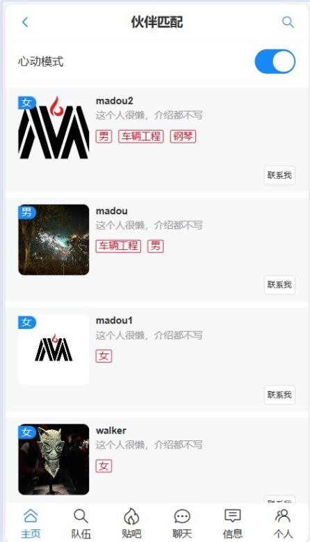
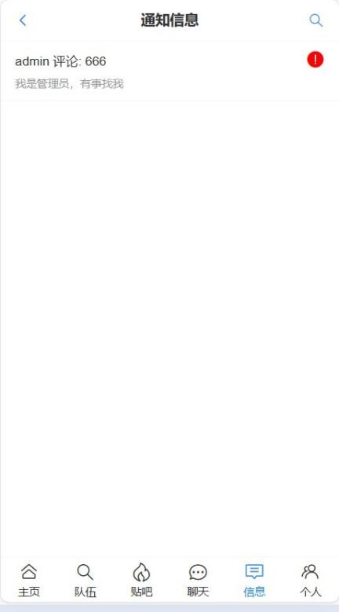
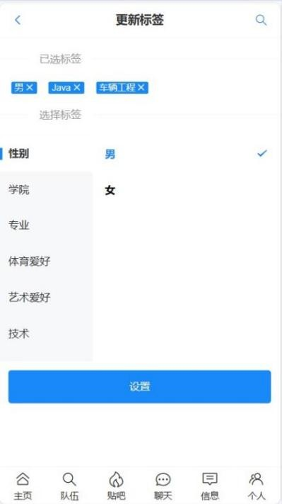

# 前言
***
校园匹配项目的前端源码，主要是用于总结学习SpringBoot的知识，在学校中难以寻找到与自己志气相投的同学，所以自己编写了系统寻找校园内的同学。

后端功能主要分为，用户管理功能，队伍功能，帖子功能，聊天功能，信息通知功能。[后端源码项目](https://github.com/MA-douzhang/Gebase)

该项目有完整论文，如有需要请添加WX号：wozuisuainizuichou
## 技术栈
***
Spring Boot + Mybatis(Plus) + MySQL + Redis + WebSocket + Swagger

## 说明
***
>如果对您有帮助，您可以右上角点一个“start”支持一下，👍
>
> 如有问题请直接在 Issues 中提，或者您发现问题并有非常好的解决方案，欢迎 PR 👍

# 效果展示
***
 
 
 
 
 
 
## 目标功能
***
+ [x] 登录注册功能
+ [X] 推荐用户功能（心动模式）
+ [X] 队伍功能
+ [x] 创建加入队伍
+ [x] 查看队伍信息
+ [x] 帖子功能
+ [x] 添加删除帖子
+ [x] 评论帖子
+ [x] 在线单聊功能
+ [x] 个人信息修改功能
+ [x] 上传头像
+ [x] 根据标签搜索用户
+ [x] 给帖子点赞功能
+ [ ] 聊天信息的记录
~~给开发者打钱的支付功能~~

# 总结
1. 后端项目这块，作为自己从学习他人的代码，编程思想，加上自己的想法，自己构思功能的实现，详细到每一步的实现和可能出现的问题，自己边记笔记边完成，收益颇多
2. 伙伴校园项目陆陆续续做了一个寒假才完成，但是项目中还有许多许多的细节问题，和没完成的功能，因为自己时间精力有限，暂时没时间完成，以后有时间会继续完善该项目
3. 在对项目做上线部署时，碰见了许多问题，跨域，接口地址错误，cookie种不上，因为服务器上没有redis，直接部署到服务器上出现问题，自己一步步修改bug，不断的锻炼自己修改bug的能力。
4. 线上部署时，项目部署在Linux服务器上时因为图片访问地址和储存地址的问题，配置文件session的作用域要为服务器地址，才能使前后端部署成功。

# 2.0版本
***
1. 完善了帖子模块，完成对帖子发布，帖子评论，点赞功能，并对帖子数据做缓存，提高查询速度。
2. 新增了信息通知功能，对帖子中的评论和点赞会推送信息给帖子的创建者。
3. 对用户模块，队伍模块，帖子模块都做了数据缓存，并使用Redisson锁保证事务的安全性。
4. 增加如何本地部署和服务器部署文档
5. 新增加了自动回复机器人（chatGPT）项目地址：[Gebase-auto-reply](https://github.com/MA-douzhang/Gebase-auto-reply)

+ [x] Redis对数据缓存
+ [x] 用分布式锁对事务做原子性操作
+ [x] 信息通知功能
+ [ ] 完善聊天功能
+ [ ] 优化用户推荐算法

# 总结
***
1. 在更新这个项目同时自己学习了Redis技术，并学以致用，虽然Redis中有很多技术没用上，如Feed流对信息做推送，因为自己对这部分技术还是不太了解，不能想出这部分业务该如何实现。  
2. 在新增功能的过程中会发现自己之前写代码时没考虑完善留下的坑，设计的缺陷，导致会不断地修改之前的数据库和一些业务代码。
3. 希望这个项目能帮助我不断学习。 
